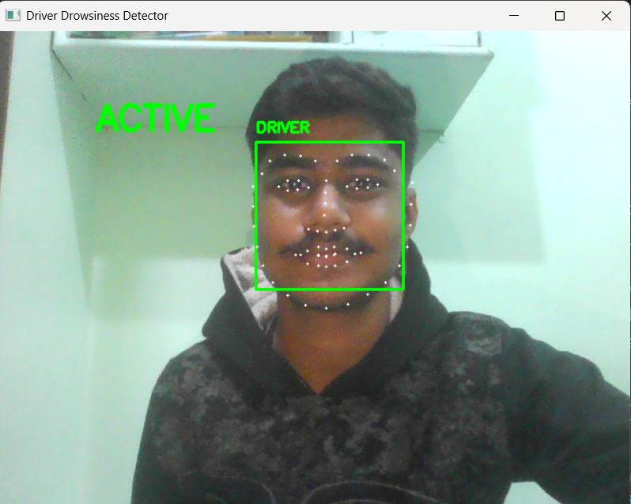

# 🚗 Driver Drowsiness Detection System

## 📌 Overview
This project is a real-time Driver Drowsiness Detection System developed using computer vision techniques.  
It monitors the driver's eye and mouth movements to detect fatigue and provides instant alerts to prevent accidents.

---

## 🎯 Features
✔ Eye closure detection using EAR (Eye Aspect Ratio) 👁️  
✔ Yawn detection using MAR (Mouth Aspect Ratio) 😮  
✔ Smart alert system (2-sec warning & 3-sec alarm) 🚨  
✔ Real-time webcam monitoring 🎥  
✔ Audio alert using alarm sound 🔊  
✔ Reduced false alarms using time-based logic  

---

## 🛠️ Technologies Used
- Python
- OpenCV
- dlib
- NumPy
- imutils
- Pygame

---

## ⚙️ Working Principle
1. Webcam captures real-time video  
2. Face and facial landmarks are detected  
3. EAR is calculated to monitor eye closure  
4. MAR is calculated to detect yawning  
5. Alerts are triggered based on conditions  

---

## ▶️ How to Run the Project

pip install -r requirements.txt  
python drowsiness.py  

---

## 📂 Project Structure

driver-drowsiness-detection/  
│  
├── drowsiness.py  
├── requirements.txt  
├── alarm.wav  
├── yawn.wav  
├── screenshots/  

---

## 📷 Output Screenshots

### 🟢 Active State

### ⚠️ Warning State

### 🚨 Alarm State

### 😮 Yawn Detection

---

## 🚀 Future Scope
- AI/Deep Learning integration  
- Mobile app support  
- Night vision (low-light detection)  
- Cloud-based driver monitoring system  

---

## 👨‍💻 Author
Adarsh Umre  

---

## ⭐ If you like this project
Give it a ⭐ on GitHub!
